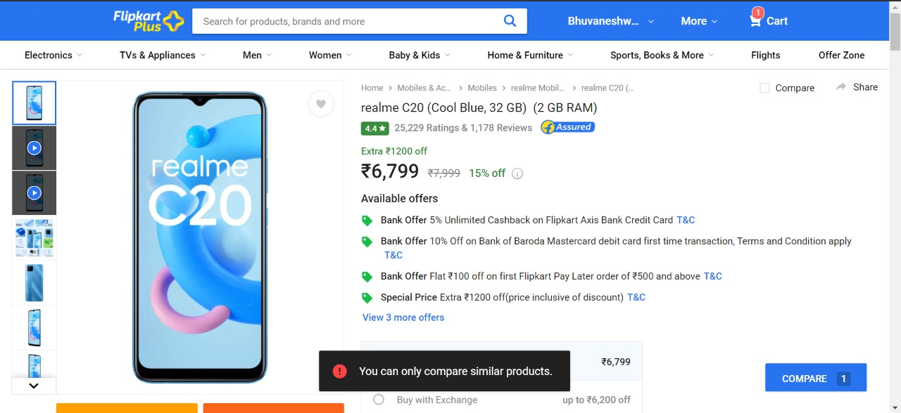
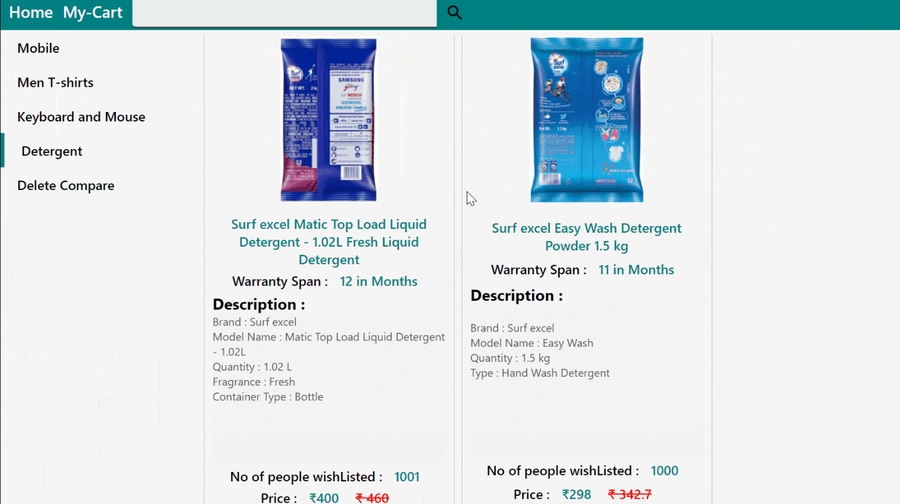
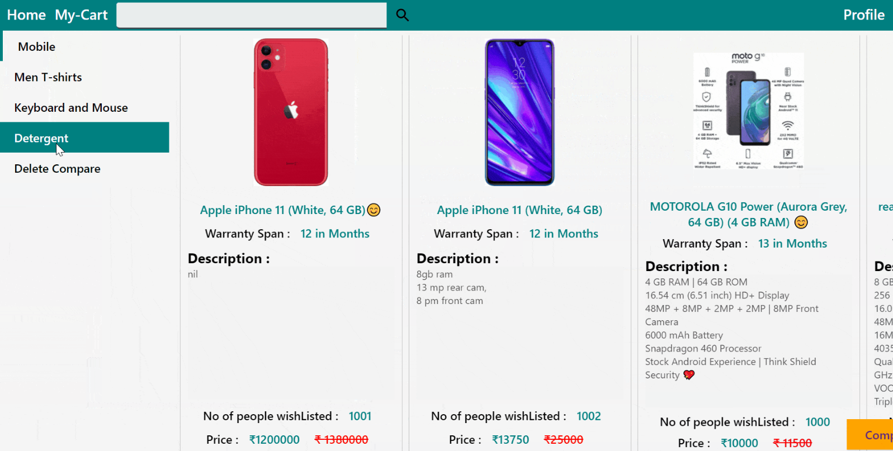
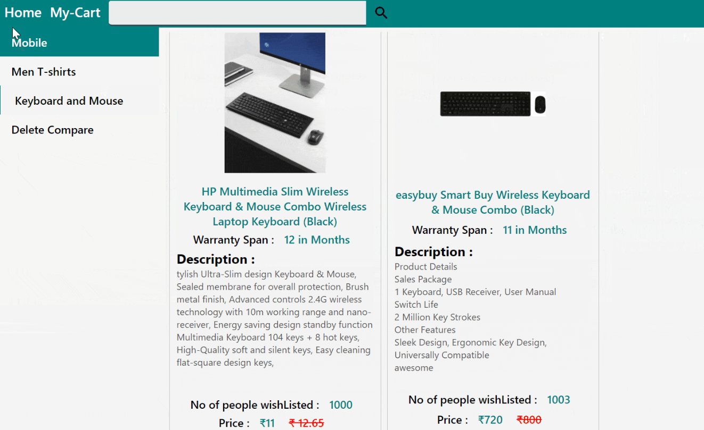

> # _EasyBuy_ an E-commerce website

        Hellow everyone, we did this project for my final year project.

> By **we** I meant :

| Contributor      | Contribution In                     |
| ---------------- | ----------------------------------- |
| Bhuvaneshwaran.k | MongoDb, ExpressJs, ReactJS, NodeJS |
| Kaviya.s         | ReactJS, NodeJS                     |
| Sandeep.s        | ExpressJs, NodeJS                   |

---

---

> ### Feature's covered :

    * A complete login,signup and forgot password Authentication.
    * Session and cookies are maintained to Achieve the Persistence user login state.
    * switch to seller Account.
    * Add products and Edit products detials.
    * add to cart and add compare

```
I know that you already judged that this is going to be a typical e-commerce website. But that is not the case here.
we do have a unique feature that actually goona speads up the Buyer's Add to compare section.
```

#### if you see **FLIPKART** does not allow user compare products in a different category at same time. As a user we personally feel that this needs to be improvised.


<br/>
<br/>

> #### So we allowd the user to compare different category products simultaneously

---



---



---



---

```shell
    SO YOU WOULD HAVE NOTICED THAT USER CAN ACTUALLY COMPARE DIFFERENT CATEGORY SIMULTANEOUSLY.
```
